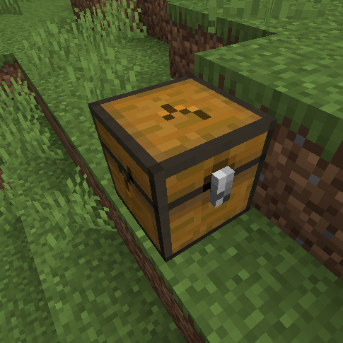

# Block break animation

The plugin has a support for block break animations. The animation looks like that:

<figure><figcaption><p>The chest break animation</p></figcaption></figure>

If you are using paper the animation is already supported. If you are using spigot, you have to install ProtocolLib to add the support for the animation.

You can disable this feature by modifing the configuration file (plugins/DeathChest/config.yml).

```yaml
break-effect:
  enabled: true # Set this value to false to disable the break animation feature.
  view-distance: 20.0 # Describes the view distance of the breaking animation
```
