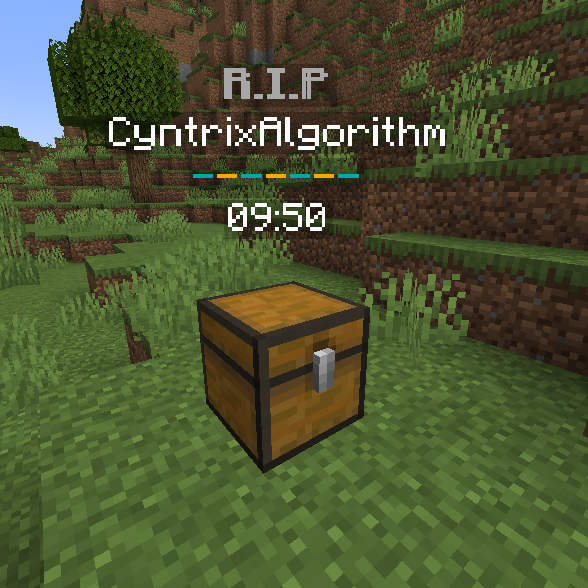

# Expiration

If you don't want to vary far away from the minecraft logic you can use the minecraft expiration. This lets the chest disappear after a certain time.

<figure><figcaption><p>Shows the time when the chest disappear</p></figcaption></figure>

If you want to change the expiration time you can edit it in the configuration file (plugins/DeathChest/config.yml):

```yaml
duration-format: 'mm:ss'
# The expiration of the chest in seconds.
# You can deactivate the expiration by setting the value to -1
expiration: 600
no-expiration-permission:
  enabled: false
  permission: 'deathchest.stays-forever'
# If this feature is enabled all caught items will be dropped if the chest has expired.
drop-items-after-expiration: false
```

The plugin also support to drop the items after the chest disappear and that the chest doesn't disappear for players with a specific permission.
