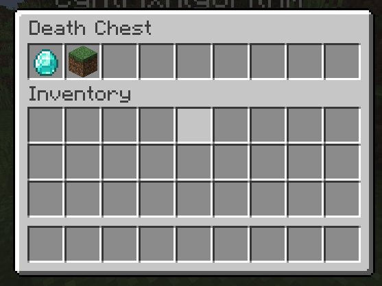

# Inventory

<figure><figcaption><p>Depicts the inventory of the death chest</p></figcaption></figure>

The inventory contains all dropped items. You can modify the inventory by editing the following properties in the configuration file (plugins/DeathChest/config.yml):


```yaml
inventory:
  # Here you can use the Placeholder API and
  #   ${player_name}: Name
  #   ${player_displayname}: Displayname
  #   ${duration}: Time left
  title: 'Death Chest'
  # Possible values are: 'constant' and 'flexible'
  # constant: the size of the inventory is always 45 slots large
  # flexible: the size of the inventory depends on the items which had the player in the inventory.
  size: flexible
```
