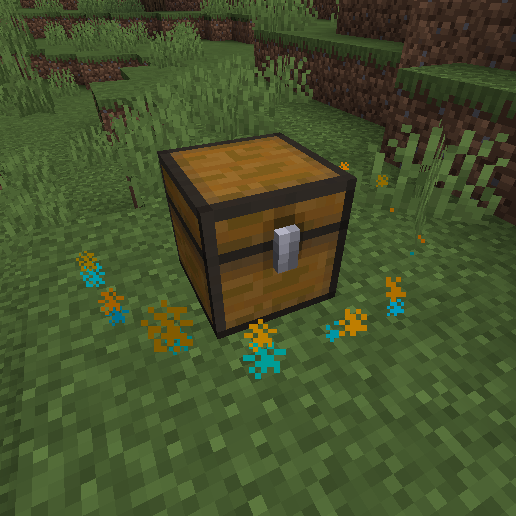

# Particle animation

<figure><figcaption><p>Particle animation around the chest</p></figcaption></figure>

You can configure the particle animation in the configuration file (plugins/DeathChest/config.yml):

```yaml
particle:
  enabled: true # Sets this to false to disable the particle effects
  radius: 1.0   # Configure the radius the the circles.
  count: 32     # Configure the count of particle per circle
  # Maximum is 20
  speed: 20.0   # Configure the speed of the circle (0.0 > x >= 20.0)

```
